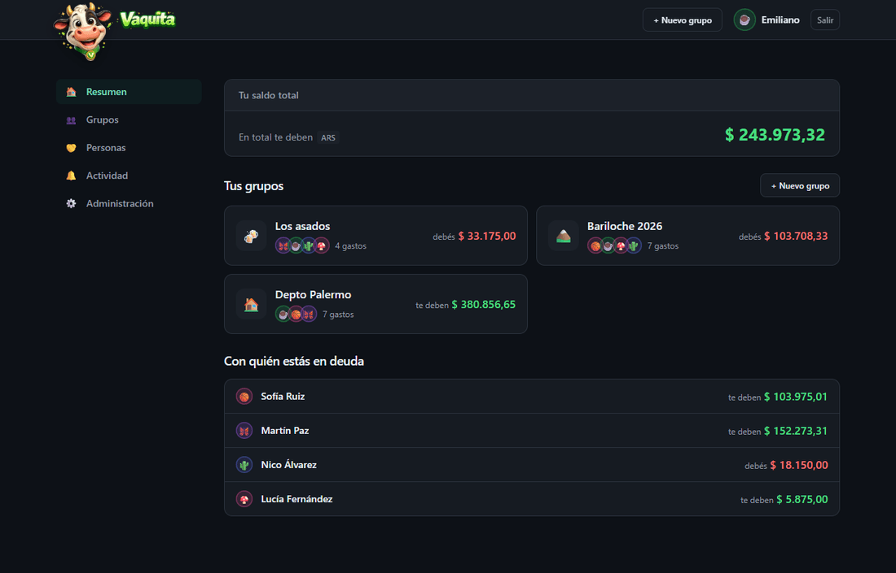
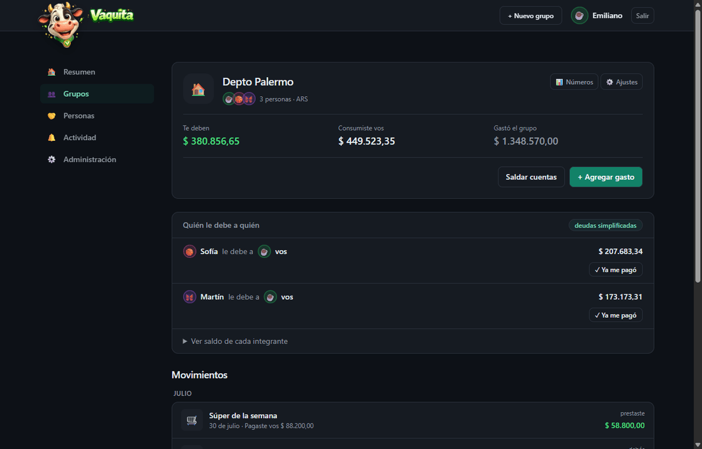

<p align="center">
  
</p>

<p align="center">
  <strong>Gastos compartidos entre amigos, autoalojado.</strong><br>
  Como hacer una vaquita, pero sin que nadie tenga que llevar la cuenta en una servilleta.
</p>

<p align="center">
  
  
  
  
</p>

---

Registro cerrado por invitación, sin apps de terceros, sin límites de free tier.

<p align="center">
  
</p>

<p align="center">
  
  <br>
  <sub>Adentro de un grupo: quién le debe a quién, ya simplificado, y el botón para saldar de un click.</sub>
</p>

> Este archivo es cómo levantarlo y desplegarlo.
> [`CONTEXT.md`](CONTEXT.md) explica por qué las cosas son como son y qué se decidió no hacer.
> [`AGENTS.md`](AGENTS.md) es la guía para trabajar en el código.

## Qué hace

- **Grupos** con moneda propia, ícono y archivado.
- **Gastos** con cuatro formas de dividir: partes iguales, montos exactos,
  porcentajes y partes (ej. 2 partes para quien viene en pareja).
- **Varios pagadores** en un mismo gasto.
- **Balances** por grupo y consolidados por persona.
- **Simplificación de deudas** opcional por grupo: en vez de A→B y B→C,
  sugiere A→C directo.
- **Pagos** (settlements) para saldar cuentas, con sugerencias precargadas.
- **Comentarios** en cada gasto y **feed de actividad** por grupo.
- **Invitaciones** por link: de un solo uso, o ilimitado para mandar al grupo de
  WhatsApp, con vista previa al compartirlo.
- Modo claro y oscuro automático, responsive.

## Stack

| | |
|---|---|
| Framework | Next.js 16 (App Router, Server Actions) |
| Lenguaje | TypeScript |
| Base | PostgreSQL 17 + Prisma 7 (driver adapter `pg`) |
| Estilos | Tailwind CSS 4 |
| Auth | Sesiones propias en cookie httpOnly + bcrypt |
| Deploy | Docker (multi-stage) → Coolify |

### Cómo se maneja la plata

Todos los importes se guardan como **enteros en centavos** (`BigInt`), nunca
como float. El reparto usa el método del resto mayor, así la suma de las partes
da siempre exactamente el total del gasto — no se pierde ni se inventa un centavo.

## Desarrollo local

```bash
npm install
cp .env.example .env          # editá los valores
docker compose -f docker-compose.dev.yml up -d   # Postgres en el 5433
npx prisma migrate deploy     # crea las tablas
npm run db:seed               # datos de ejemplo (opcional)
npm run dev
```

Abrí http://localhost:3000.

Si corriste el seed, entrás con el email de `BOOTSTRAP_ADMIN_EMAIL` y la
contraseña `vaquita1234`. **Ojo: el seed borra toda la base.**

### Scripts

| Comando | Qué hace |
|---|---|
| `npm run dev` | Servidor de desarrollo |
| `npm run build` | `prisma generate` + build de producción. Es el chequeo de tipos: no hay tests ni linter. |
| `npm run db:migrate` | Crea una migración nueva a partir del schema |
| `npm run db:deploy` | Aplica migraciones pendientes (producción) |
| `npm run db:studio` | Prisma Studio para mirar la base |
| `npm run db:seed` | Carga datos de ejemplo (destructivo) |

## Deploy con Docker Compose

```bash
cp .env.example .env    # completá AUTH_SECRET, APP_URL, POSTGRES_PASSWORD…
docker compose up -d
```

Levanta la app y su base. Las migraciones se aplican solas al arrancar. Poné un
reverse proxy adelante (Caddy, nginx, Traefik) para el dominio y el certificado.

## Deploy en Coolify

Hay dos caminos. El de abajo crea la base como recurso propio de Coolify, que
es lo que te habilita sus **backups automáticos** — para una app donde el dato
es el producto, eso solo justifica los dos minutos extra.

Si preferís levantar todo de una, usá Build Pack **Docker Compose** con
*Docker Compose Location* en `/docker-compose.coolify.yml`, y cargá las
variables de la tabla del paso 3 salvo `DATABASE_URL` (esa se arma sola) más
`POSTGRES_PASSWORD`. Los backups en ese caso corren por tu cuenta.

1. **Base de datos**: en tu proyecto de Coolify, `+ New` → `Database` →
   `PostgreSQL 17`. Anotá la connection string interna.

2. **Aplicación**: `+ New` → `Public/Private Repository` →
   `github.com/eerginos/vaquita`.
   - Build Pack: **Dockerfile**
   - Port: **3000**
   - Health check path: `/api/salud`

3. **Variables de entorno**:

   | Variable | Valor |
   |---|---|
   | `DATABASE_URL` | La connection string interna del Postgres de Coolify |
   | `AUTH_SECRET` | `openssl rand -hex 32` |
   | `APP_URL` | La URL pública, por ejemplo `https://vaquita.tudominio.com` |
   | `BOOTSTRAP_ADMIN_EMAIL` | Tu email |

   La zona horaria **no** es una variable: se elige desde `/admin` y queda
   guardada en la base. `TZ` sólo se usa como valor inicial la primera vez.

4. **Dominio**: poné el tuyo, el mismo que `APP_URL`. Coolify saca el
   certificado con Let's Encrypt solo.

5. Deploy. El contenedor corre `prisma migrate deploy` al arrancar, así que
   las tablas se crean solas.

6. Entrá a `/registro` con el email de `BOOTSTRAP_ADMIN_EMAIL`: como la base
   está vacía, esa primera cuenta se crea sin invitación y queda como admin.
   A partir de ahí el registro queda cerrado.

## Cómo sumar gente

No hay envío de mails (a propósito: una dependencia menos). Todo va por link:

- **Alguien nuevo** → `/admin` → *Invitar a alguien nuevo* → generás el link y
  se lo pasás por WhatsApp. Vence a los 14 días, se usa una sola vez.
- **Alguien nuevo directo a un grupo** → configuración del grupo →
  *Invitar gente nueva*. Al crear la cuenta ya entra al grupo.
- **Alguien que ya tiene cuenta** → configuración del grupo →
  *Sumar gente que ya tiene cuenta*.
- **Se olvidó la contraseña** → `/admin` → *Restablecer una contraseña* →
  generás un link que vence en 24 horas y se lo pasás.

## Notas de seguridad

- Las contraseñas se guardan con bcrypt (12 rondas).
- El login tiene freno a la fuerza bruta: 5 intentos fallidos por cuenta
  y 20 por IP en una ventana de 15 minutos, con esperas que crecen
  (1, 2, 5, 15, 30 minutos). El contador es por IP *y* email, así nadie
  puede dejarte afuera de tu propia cuenta a propósito.
- El token de sesión viaja en una cookie `httpOnly` + `SameSite=Lax`;
  en la base sólo se guarda su HMAC-SHA256 con `AUTH_SECRET`, nunca el token.
- Cambiar la contraseña cierra todas las demás sesiones.
- `AUTH_SECRET` es obligatorio y tiene que tener al menos 16 caracteres:
  si cambia, todas las sesiones y los links de reset dejan de valer.
- Todas las Server Actions revalidan la membresía al grupo antes de tocar nada.

## Qué quedó afuera (por ahora)

Multi-moneda con conversión, recibos adjuntos, gastos recurrentes y
notificaciones por email. La estructura ya está preparada: los gastos guardan
`currency` propio y los balances se agrupan por moneda.

## Licencia

[MIT](LICENSE) — hacé lo que quieras con esto, manteniendo el aviso de
copyright. Se entrega sin garantías: si lo desplegás, la responsabilidad de
que los números estén bien es tuya.
